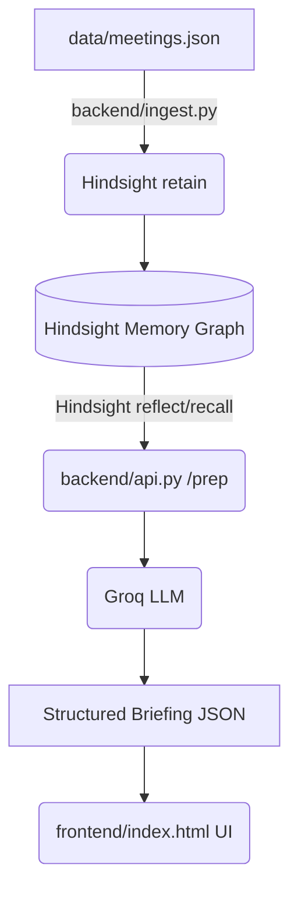

# Architecture Guidelines

This directory contains documentation for the Meeting Prep Agent's overall architecture.

## Overview
- **Data Layer**: Synthetic JSON generation via Groq API.
- **Memory Layer**: Vectorize Hindsight API for memory retention, recall, and reflection.
- **Application Layer**: FastAPI backend and HTML/JS frontend.

## Architecture Diagram

